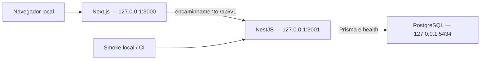

# Arquitetura

Referência: F3, versão `0.3.0`, 03/10/2026. O estado da entrega e as evidências executadas ficam em `../relate.md`; este documento registra decisões e fronteiras de responsabilidade.

## Fundação F1

A raiz do repositório é um monorepo pnpm + Turborepo. Web e API rodam como processos locais; o Compose contém somente PostgreSQL. A aplicação web inicial identifica o ambiente de desenvolvimento. A F2 acrescenta módulos de banco, autenticação e domínio na API; as telas públicas e administrativas seguem as fases F3–F6.

| Caminho                  | Responsabilidade                                                       |
| ------------------------ | ---------------------------------------------------------------------- |
| `apps/web`               | Next.js App Router, React e Tailwind; interface e renderização         |
| `apps/api`               | NestJS; configuração, health, tratamento de erros e logging sanitizado |
| `packages/ui`            | Biblioteca visual React, tokens e estilos compartilhados da F3         |
| `packages/types`         | Contratos públicos independentes de modelos de persistência            |
| `packages/config`        | Validação e convenções de ambiente, sem exportar segredos ao navegador |
| `packages/eslint-config` | Regras compartilhadas de lint                                          |
| `packages/tsconfig`      | Configuração TypeScript estrita compartilhada                          |
| `docs`                   | Decisões, limites e procedimentos por camada                           |

As dependências entre pacotes locais usam `workspace:*`; a instalação é resolvida pelo único `pnpm-lock.yaml` da raiz. Essa organização segue o [modelo de workspaces do pnpm](https://pnpm.io/workspaces).

## Versões e reprodução

As versões selecionadas para a fundação são fixadas nos manifests e no lockfile; esses arquivos prevalecem sobre uma cópia desta tabela caso uma correção documentada os altere.

| Ferramenta       | Seleção da F1                                                   |
| ---------------- | --------------------------------------------------------------- |
| Node.js          | `24.18.0`, linha LTS 24                                         |
| pnpm             | `11.25.0`                                                       |
| Turborepo        | `2.11.7`                                                        |
| TypeScript       | `5.9.3`                                                         |
| Next.js / React  | `16.3.8` / `19.3.0`                                             |
| Tailwind CSS     | `4.3.3`                                                         |
| NestJS / Swagger | `12.1.2` / `12.0.2`                                             |
| Prisma           | `7.10.0`, reservado para a persistência da F2                   |
| PostgreSQL       | `17.11-alpine`; imagem oficial e digest fixados no Compose e CI |

`package.json` raiz é a referência da versão do projeto. Apps e pacotes privados acompanham `0.3.0`; não são releases independentes nem são publicados em registry. Versões 0.x seguem os marcos do plano; correções incrementam PATCH e uma mudança funcional incrementa MINOR. A política segue o formato do [Versionamento Semântico](https://semver.org/lang/pt-BR/).

## Fluxo local

As portas são publicadas em loopback. O projeto Compose `filaretti-local` e seu volume persistente isolam esse banco de outros projetos. O navegador usa `/api/v1` na origem da web; o rewrite encaminha a requisição e os cookies para a API. Leituras no servidor podem consultar a API diretamente. Regras e autorização permanecem no NestJS; o encaminhamento não as duplica.

## Contratos e configuração

Os contratos de domínio, health e erro são descritos em [api.md](api.md). O probe usa o driver PostgreSQL para executar `SELECT 1` e permanece independente das tabelas. O DatabaseModule global fornece PrismaService com adapter PostgreSQL e desconexão no encerramento. AuthModule fornece guardas e sessões; DomainModule aplica DTOs, propriedade, relações e projeções públicas. O cliente Prisma é gerado nos scripts de build/typecheck/dev e explicitamente no CI; código gerado não é versionado.

Cada processo valida sua configuração antes de iniciar. `APP_ENV` identifica o ambiente de dados/operação, independentemente de `NODE_ENV`, que também é usado pelo build do Next.js. Um build local de produção continua com `APP_ENV=development`; em `APP_ENV=production`, mocks são rejeitados e HTTPS/cookies seguros são obrigatórios.

URLs públicas e internas são separadas: `API_INTERNAL_URL` fica no servidor; `NEXT_PUBLIC_SITE_URL` e `NEXT_PUBLIC_API_BASE_PATH` são públicos. Arquivos locais de ambiente ficam ignorados pelo Git. As chaves de integrações futuras são documentadas como placeholders inativos, sem exigir contas externas para iniciar a F1. `R2_ENABLED`, `RESEND_ENABLED` e `TURNSTILE_ENABLED` permanecem `false`; sua ativação é rejeitada enquanto os adaptadores não existirem. O fluxo de geração local fica em [deployment.md](deployment.md).

As tarefas de lint, typecheck, testes e build são orquestradas na raiz. Configuração usa Vitest; a API usa o test runner nativo do Node, com TypeScript compilado e HTTP real. A integração de health exige PostgreSQL real. CI instala pelo lockfile e executa lint, typecheck, testes unitários, `pnpm test:integration` e build; não publica artefatos nem faz deploy automático. Logs e erros devem preservar os limites de [security.md](security.md).

## Evolução autorizada por fase

Na F3, `@filaretti/ui` exporta componentes React e CSS sem dependências do backend. A web carrega Inter/Cormorant por next/font e contém layouts consumidores em `components/site` e `components/admin`. A demonstração local tem Proxy de acesso anterior ao streaming, guarda servidor e renderização dinâmica; não consome a API nem cria sessão. O pacote compartilhado e os layouts recebem dados/ações por props para integração nas F4–F6. Detalhes e limites: [design-system.md](design-system.md).

| Fase   | Próxima responsabilidade                                                  |
| ------ | ------------------------------------------------------------------------- |
| F2     | Prisma, migrations, seeds fictícios, autenticação, roles e API de domínio |
| F3     | Tokens visuais e componentes reutilizáveis, layouts e revisão responsiva  |
| F4–F5  | Rotas institucionais/editoriais sobre contratos reais e política de cache |
| F6     | CMS, storage, preview, publicação agendada e invalidação persistida       |
| F7     | Contato, newsletter, busca, SEO e privacidade                             |
| F8     | QA integrado, serviços externos reais, homologação e recuperação          |
| F9–F10 | Conteúdo aprovado, migração, gate contra mocks e produção autorizada      |

Redis não é dependência inicial. Tarefas futuras terão estado persistido em PostgreSQL, retries limitados e idempotência. Nenhum worker, adaptador de fornecedor ou fluxo editorial é apresentado como implementado pela fundação.
